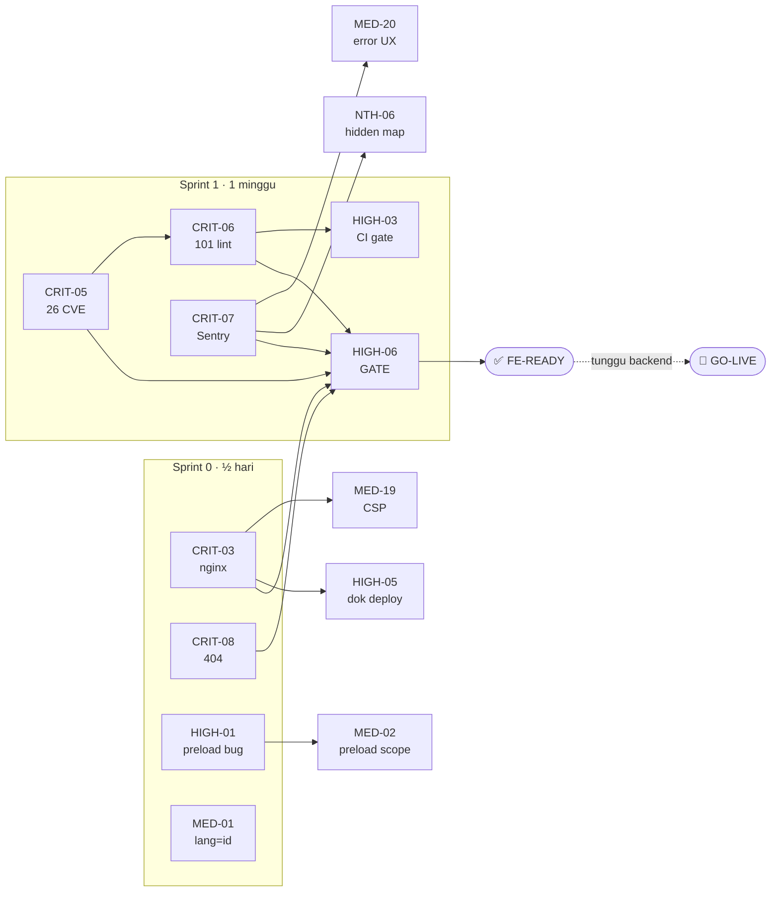

# Sprint Plan — Frontend Angular Scope
### Malakabooks Store (SS Online Shop)

| | |
|---|---|
| **Sumber** | [frontend-readiness-audit.md](frontend-readiness-audit.md) · [frontend-readiness-tasks.md](frontend-readiness-tasks.md) |
| **Tanggal** | 11 Agustus 2026 |
| **Branch** | `ssonlineshop` |
| **Cakupan** | **38 task frontend** dalam 5 sprint |
| **Estimasi ke FE-ready** | **~1,5 minggu** (Sprint 0 + Sprint 1 + Gate) |

> **Versi lengkap:** [production-readiness-sprints.md](production-readiness-sprints.md) — 46 task termasuk auth & backend. Dokumen itu **tidak diubah** dan tetap menjadi bahan diskusi dengan tim backend.

---

## Perbedaan dengan Versi Lengkap

Dengan mengeluarkan 8 task auth/backend, rencana ini menjadi **jauh lebih cepat** — bukan karena pekerjaannya berkurang banyak, tapi karena **waktu tunggu hilang sepenuhnya.**

| | Versi lengkap | Versi frontend |
|---|---|---|
| Jumlah task | 46 | **38** |
| Task kritikal | 9 | **5** |
| Track paralel di Sprint 1 | 4 (2 menunggu backend) | **3 (nol menunggu)** |
| Durasi Sprint 1 | 2 minggu | **1 minggu** |
| Total ke gate | 2–3 minggu | **~1,5 minggu** |

Di versi lengkap, Track A dan Track D menghabiskan sebagian besar waktunya **menunggu balasan backend** — dan waktu tunggu itu tidak bisa dikompres dengan menambah developer. Di versi ini tidak ada satu pun task yang menunggu pihak lain, sehingga durasi sprint benar-benar ditentukan oleh kapasitas tim.

> ⚠️ **FE-ready ≠ siap rilis.**
> Menyelesaikan seluruh 38 task membuat **lingkup frontend** siap. Empat item auth/backend (`CRIT-01`, `CRIT-02`, `CRIT-04`, `CRIT-09`) tetap harus tuntas sebelum aplikasi benar-benar bisa go-live. Rencana ini mempersiapkan frontend agar tidak menjadi jalur kritis saat backend selesai.

---

## Prinsip Pengelompokan

**1. Task yang menyentuh file yang sama dikerjakan bersamaan.**
Membuka `angular.json` tiga kali di tiga sprint berbeda adalah pemborosan.

**2. Nice-to-Have tidak ditunda ke akhir — ia menumpang sprint yang membuka file yang sama.**
Ini perubahan terpenting dari daftar bertingkat. `NTH-02` (`@types/*`) dan `NTH-03` (`engines`) sama-sama mengubah `package.json` yang memang sedang dibuka untuk `CRIT-05`. Effort tambahannya nyaris nol saat menumpang; jadi task tersendiri di kemudian hari, masing-masing butuh PR, review, dan deploy sendiri.

**3. Task dengan alat verifikasi yang sama dikerjakan berdekatan.**
Seluruh kelompok performa diverifikasi dengan Lighthouse + network tab + output build. Satu sesi pengukuran, satu baseline, satu perbandingan sesudah — bukan lima kali buka Lighthouse.

---

## Peta Ketergantungan

---

## Ringkasan Sprint

| Sprint | Nama | Durasi | Task | Blocker rilis FE? |
|---|---|---|---|---|
| **0** | Hotfix Quick Win | ½ hari | 5 | **Ya** |
| **1** | Rilis-Ready Frontend | 1 minggu | 15 | **Ya** |
| **✅** | **Gate — HIGH-06** | 1 hari | *(termasuk S1)* | **Ya** |
| **2** | Stabilisasi | 1–2 minggu | 5 | Tidak |
| **3** | SEO, Performa & Kualitas | 2–3 minggu | 11 | Tidak |
| **4** | Epic — SSR & PWA | 3–4 minggu | 2 | Tidak |

---
---

# 🔥 SPRINT 0 — Hotfix Quick Win
### *Durasi: ½ hari · 5 task · Semua effort `S`*

**Tujuan:** menutup tiga kegagalan yang terlihat pelanggan di jam pertama, dengan effort total di bawah setengah hari.

### Kenapa dikelompokkan begini

Kelima task tidak punya kesamaan tematik — yang menyatukan mereka adalah **rasio dampak terhadap effort yang ekstrem**. Semuanya `S` atau lebih kecil, tidak butuh koordinasi siapa pun, dan tidak saling bergantung. Bisa dikerjakan satu orang dalam satu sesi, atau dibagi dua tanpa konflik merge.

Dipisah dari Sprint 1 supaya bisa **dikerjakan hari ini juga**, tidak menunggu perencanaan sprint.

### Task

| ID | Task | Effort | File utama |
|---|---|---|---|
| `CRIT-03` 🛠️ | `nginx.conf` — SPA fallback + brotli/gzip + cache header + HSTS/nosniff/referrer | S | *(file baru)* |
| `CRIT-08` | `NotFoundComponent` + route `/404` + perbaiki `admin-host.guard` | S | `app.routes.ts`, `admin-host.guard.ts` |
| `HIGH-01` | Perbaiki `timer(1000).pipe(() => load())` → `switchMap` | 5 menit | `selective-preloading-strategy.ts` |
| `HIGH-05` 🛠️ | Dokumentasikan proses deployment | S | `README.md` / `DEPLOYMENT.md` |
| `MED-01` | `<html lang="en">` → `lang="id"` | 30 detik | `src/index.html` |

### Catatan pengerjaan

- **`CRIT-03` + `HIGH-05` satu paket** — sama-sama pekerjaan deployment, satu PR. Template `nginx.conf` lengkap ada di [frontend-readiness-audit.md](frontend-readiness-audit.md) Kategori 7.
- **CSP sengaja TIDAK di sini.** Meski filenya sama dengan `CRIT-03`, CSP butuh pengujian login Google (`accounts.google.com`) dan checkout DOKU (`jokul.doku.com`) yang bisa memakan waktu. Header murah tanpa risiko (HSTS, `X-Content-Type-Options`, `Referrer-Policy`) tetap masuk sekarang; CSP penuh menyusul di Sprint 1 Track C.
- **`HIGH-01`** — `selective-preloading-strategy.ts` sedang *modified* di working tree. Periksa perubahan yang belum ter-commit sebelum menimpanya.

### Definition of Done

- [ ] Refresh langsung di `/product/123` memuat halaman, bukan 404 web server
- [ ] Response header menunjukkan `content-encoding: br`
- [ ] `/halaman-ngawur` menampilkan halaman 404 dengan URL tetap
- [ ] `/admin` dari domain publik menampilkan 404, bukan homepage
- [ ] Network tab: preload chunk mulai ~1 detik setelah initial load

---
---

# 🚨 SPRINT 1 — Rilis-Ready Frontend
### *Durasi: 1 minggu · 15 task · 3 track paralel*

**Tujuan:** menutup seluruh sisa temuan kritikal frontend. Tiga track dirancang berjalan bersamaan **tanpa konflik file** dan **tanpa menunggu siapa pun.**

### Kenapa dibagi 3 track

| Track | Fokus | Area file | Blokir eksternal |
|---|---|---|---|
| **A** | Dependency & Quality Gate | `package.json`, `angular.json`, `.github/`, lint lintas file | — |
| **B** | Observability & Error UX | `core/errors/`, `core/interceptors/error.*` | Akun Sentry *(admin, bukan backend)* |
| **C** | Keamanan Frontend | `nginx.conf`, `shipping-label.service.ts` | Akses deploy |

Ketiganya menyentuh area file yang **sepenuhnya terpisah** — bisa tiga orang paralel tanpa satu pun konflik merge.

---

## Track A — Dependency & Quality Gate
*Owner: 1 FE dev · Track terbesar*

| ID | Task | Effort | Catatan |
|---|---|---|---|
| `CRIT-05` | `npm audit fix` + bump Angular ke `21.2.19+` | M | 26 CVE (1 critical, 19 high) |
| `CRIT-06` | 101 lint error → 0 | M | Batch cepat 28 error dulu |
| `HIGH-03` | CI: trigger branch, `npm audit` gate, upload artifact | S | Setelah dua di atas hijau |
| `NTH-01` | Housekeeping — hapus `lint_results.txt` dkk | S | Menumpang `CRIT-06` |
| `NTH-02` | `@types/*` → `devDependencies` | S | Menumpang `CRIT-05` |
| `NTH-03` | `engines` + `.nvmrc` | S | Menumpang `CRIT-05` |
| `NTH-04` | Hapus `security.allowedHosts` kosong | S | Menumpang `angular.json` |
| `NTH-05` | Tambah `qrcode` ke `allowedCommonJsDependencies` | S | Menumpang `angular.json` |

**Kenapa dikelompokkan:** `CRIT-05`, `NTH-02`, `NTH-03` semuanya mengubah `package.json`. `NTH-04` dan `NTH-05` sama-sama `angular.json`. `NTH-01` dan `CRIT-06` sama-sama "membersihkan hasil lint". Digabung berarti satu kali `npm install`, satu kali regression test, satu PR.

**Urutan wajib:** `CRIT-05` → `CRIT-06` → `HIGH-03`. Menaikkan versi Angular bisa memunculkan lint error baru, jadi jangan hijaukan lint sebelum dependency final.

**Catatan `CRIT-06`:** timebox 46 error `no-explicit-any`. Kalau tidak selesai, dorong ke `MED-16` di Sprint 3 — 55 error sisanya bersifat mekanis dan sudah cukup untuk menghijaukan CI. Yang penting **CI hijau**.

**Catatan `NTH-01`:** hapus `lint_results.txt` **sebelum** mulai `CRIT-06`. File itu berisi 135 error tertanggal 10 Agustus sementara angka aktual 101 — jangan sampai ada yang bekerja berdasarkan daftar yang salah.

---

## Track B — Observability & Error UX
*Owner: 1 FE dev · Butuh akun Sentry*

| ID | Task | Effort | Catatan |
|---|---|---|---|
| `CRIT-07` | Pasang Sentry + release tracking + PII scrubbing | M | Butuh akun/DSN |
| `MED-20` | Notifikasi user di `GlobalErrorHandler` | S | Satu file dengan `CRIT-07` |
| `HIGH-04` | Petakan status 409 & 422 di `error.interceptor` | S | Satu file dengan `CRIT-07` |
| `NTH-06` | `sourceMap` → `hidden: true` untuk Sentry | S | Menumpang `CRIT-07` |

**Kenapa dikelompokkan:** keempatnya menyentuh jalur penanganan error yang sama — `global-error-handler.ts` dan `error.interceptor.ts`. `NTH-06` yang tadinya sekadar kerapian jadi **bermakna** di sini: hidden source map adalah yang membuat stack trace di Sentry terbaca.

**Aksi jam pertama:** siapkan akun/project Sentry. Ini pekerjaan admin, bukan koding, dan bisa memblokir sisa track.

**Jangan lupa PII scrubbing.** Aplikasi memproses data pembayaran — Sentry tanpa scrubbing hanya memindahkan kebocoran data ke pihak ketiga.

---

## Track C — Keamanan Frontend
*Owner: 1 FE dev · Butuh akses deploy untuk CSP*

| ID | Task | Effort | Catatan |
|---|---|---|---|
| `MED-19` 🛠️ | CSP penuh + verifikasi Google GSI & DOKU | S | Lanjutan `CRIT-03` |
| `MED-06` | Sanitasi AWB di `shipping-label.service` | S | Murni frontend |

**Kenapa dikelompokkan:** keduanya menutup celah keamanan yang **tidak** bergantung backend. `MED-19` melanjutkan file yang sama dengan `CRIT-03` di Sprint 0, jadi konteksnya masih segar.

**Track paling ringan** — bila kapasitas tim hanya 2 orang, gabungkan ke Track A atau B.

> CSP juga berfungsi sebagai **mitigasi berlapis** untuk risiko token-di-`localStorage` yang sedang menunggu diskusi backend (`CRIT-09` di versi lengkap). Selama solusi permanennya belum jalan, ini pertahanan termurah yang bisa frontend pasang sendiri.

---

## ✅ GATE — `HIGH-06` Verifikasi FE-Ready
*Durasi: 1 hari · Tidak boleh dilewati*

**Verifikasi otomatis:**
- [ ] `npm audit --audit-level=high` → exit code 0
- [ ] `npm run lint` → exit code 0
- [ ] `npm run test:ci` → hijau
- [ ] `ng build --configuration production` → sukses, nol warning
- [ ] CI hijau di branch `ssonlineshop`

**Verifikasi manual — memakai build production, bukan `ng serve`:**
- [ ] Refresh halaman di route dalam (`/product/:id`, `/order-history`)
- [ ] Share link produk ke WhatsApp — tidak 404
- [ ] `/halaman-ngawur` dan `/admin` dari domain publik → halaman 404
- [ ] Network tab: preload staggered ~1 detik, ≤ 4 chunk
- [ ] Response header: `content-encoding: br`, HSTS, `nosniff`, CSP aktif
- [ ] Login Google dan checkout DOKU tidak terblokir CSP
- [ ] Error yang dilempar sengaja muncul di Sentry, tanpa data sensitif

**Kriteria FE-ready:** nol temuan ❌ Kritikal frontend · skor lingkup FE ≥ 8/10 · perbarui [frontend-readiness-audit.md](frontend-readiness-audit.md).

> Setelah gate ini lolos, **frontend bukan lagi jalur kritis.** Sisa blocker go-live ada di tangan tim backend (4 item — lihat lampiran).

---
---

# SPRINT 2 — Stabilisasi
### *Durasi: 1–2 minggu · 5 task*

**Tujuan:** menutup celah yang muncul saat aplikasi menghadapi pengguna nyata — kegagalan senyap dan state kosong tanpa jalan keluar.

### Kenapa dikelompokkan begini

Semua task di sini adalah **"apa yang terjadi saat sesuatu gagal"** — dan itu baru terasa setelah ada trafik. Dikerjakan setelah gate karena masing-masing memerlukan pemahaman tentang kegagalan mana yang benar-benar sering terjadi, bukan yang kita duga.

| ID | Task | Effort | Kelompok |
|---|---|---|---|
| `MED-04` | `takeUntilDestroyed` di katalog-cart + search-bar | S | Ketahanan runtime |
| `MED-10` | Error state + retry per halaman | M | UX kegagalan |
| `MED-07` | Banner offline global | S | UX kegagalan |
| `MED-13` | Test guard, interceptor & pipe yang belum tercakup | M | Test |
| `MED-14` | Test service jalur uang + threshold coverage | M | Test |

### Catatan pengerjaan

- **`MED-10` + `MED-07` satu paket** — keduanya menambahkan UI state untuk kondisi gagal. Rancang komponen state bersama, jangan dua pola berbeda.
- **`MED-13` + `MED-14` satu paket.** Mulai dari `MED-13` (guard/interceptor/pipe — murah dan cepat) untuk membangun kebiasaan, baru `MED-14` (service jalur uang). **Pasang `thresholds` di `vitest.config.ts` lebih dulu**, meski awalnya rendah — tanpa angka yang ditegakkan, coverage akan melorot lagi.
- **`MED-04`** menyentuh jalur pembuatan order di katalog. Effort `S`, tapi jangan dilewati.

### Definition of Done

- [ ] Semua `.subscribe()` non-spec memakai `takeUntilDestroyed`
- [ ] `npm run test:ci` melaporkan coverage dan gagal bila di bawah threshold
- [ ] Blokir endpoint di DevTools → halaman menampilkan error + tombol retry yang berfungsi
- [ ] Mode airplane memunculkan banner offline

---
---

# SPRINT 3 — SEO, Performa & Kualitas
### *Durasi: 2–3 minggu · 11 task*

**Tujuan:** membuat aplikasi bisa ditemukan, dipakai semua orang, dan tidak melambat seiring waktu.

### Kenapa dikelompokkan begini

Tiga kelompok yang digabung karena sama-sama **bersifat menyapu** — masing-masing menyentuh banyak file dengan perubahan kecil yang seragam, dan semuanya cocok dikerjakan dengan alat ukur di tangan (Lighthouse, axe, bundle analyzer).

### Kelompok 3.1 — SEO *(dampak bisnis tertinggi di sprint ini)*

| ID | Task | Effort |
|---|---|---|
| `MED-17` | `Meta` + `Title` dinamis + Open Graph + JSON-LD Product | M |

> 💡 **Pertimbangkan menaikkan ke Sprint 1.** Bisa dikerjakan **tanpa** SSR, tidak bergantung siapa pun, dan langsung memperbaiki tab title, bookmark, serta preview share WhatsApp. Kalau trafik organik penting sejak hari pertama, ini task dengan rasio dampak-terhadap-effort terbaik di luar Sprint 0. Saya letakkan di sini hanya karena secara teknis bukan blocker.

### Kelompok 3.2 — Aksesibilitas & Kebersihan Template

| ID | Task | Effort |
|---|---|---|
| `MED-08` | 6 label tanpa asosiasi, 2 pelanggaran keyboard, audit kontras warna | S |
| `MED-03` | Migrasi `*ngFor` legacy terakhir → `@for` + `track` | S |
| `MED-16` | Bereskan 46 error `no-explicit-any` | M |

**Kenapa bersama:** `MED-08` dan `MED-03` menyelesaikan sisa pelanggaran lint template dari `CRIT-06`. Setelah keduanya, `ng lint` benar-benar bersih tanpa pengecualian.

### Kelompok 3.3 — Performa

| ID | Task | Effort |
|---|---|---|
| `MED-09` | Migrasi 38 `` ke `NgOptimizedImage` + dimensi eksplisit | M |
| `MED-02` | Rapikan cakupan `preload: true` (17 route → 4) | S |
| `NTH-09` | Subset font boxicons ke woff2 saja | S |
| `NTH-10` | `OnPush` di 5 komponen sisa | S |
| `NTH-07` | Perketat budget `angular.json` | S |

**Kenapa bersama:** semuanya diverifikasi dengan alat yang sama. Satu sesi pengukuran, satu baseline, satu perbandingan sesudah.

**`NTH-07` terakhir** — kunci budget setelah semua optimasi selesai, supaya baseline-nya realistis.

### Kelompok 3.4 — E2E & Housekeeping

| ID | Task | Effort |
|---|---|---|
| `MED-15` | Playwright — 3 skenario (browse+cart, checkout, admin CRUD) | M |
| `NTH-08` | Google Client ID → `environment` | S |

**`MED-15` paling akhir di sprint ini.** E2E yang ditulis di atas UI yang masih berubah (`MED-08` dan `MED-09` mengubah markup) akan langsung rusak. Tulis setelah template stabil.

### Definition of Done

- [ ] Setiap halaman produk punya title unik; preview WhatsApp menampilkan judul + gambar
- [ ] `ng lint` bersih tanpa pengecualian
- [ ] CLS < 0,1 di Lighthouse mobile untuk product-detail dan order-history
- [ ] Nol isu kontras "serious" di axe
- [ ] Network tab: ≤ 4 chunk terpreload
- [ ] `npx playwright test` hijau di CI

---
---

# SPRINT 4 — Epic: SSR & PWA
### *Durasi: 3–4 minggu · 2 task*

| ID | Task | Effort | Dependensi |
|---|---|---|---|
| `MED-18` 🛠️ | SSR / prerendering hybrid untuk halaman publik | L | `MED-17`, `CRIT-03` |
| `NTH-11` 🛠️ | Service Worker / PWA | M | `CRIT-03` |

### Kenapa dipisah jadi epic tersendiri

`MED-18` bukan sekadar task besar — ia **mengubah asumsi dasar** aplikasi:

- 55 pemakaian `localStorage` harus aman di server *(sebagian kode sudah defensif dengan `typeof localStorage === 'undefined'` ✅ — modal awal yang bagus)*
- Hosting berubah dari static host menjadi butuh **Node runtime** — konfigurasi `CRIT-03` perlu ditinjau ulang
- Rendering hybrid per-route: **SSG** `/`, `/product`, `/mardika-kopi` · **SSR** `/product/:id` · **CSR** admin & checkout

Terlalu berisiko diburu berbarengan pekerjaan lain. Butuh sprint dengan jendela regression testing tersendiri.

`NTH-11` digabung di sini karena sama-sama menyentuh lapisan penyajian dan sama-sama perlu peninjauan ulang strategi caching di `nginx.conf`.

> **Prasyarat:** `MED-17` (Sprint 3) harus selesai dulu. SSR tanpa meta tag dinamis hanya menyajikan HTML kosong lebih cepat — mesin pencari tetap melihat halaman yang seragam.

---
---

# Workstream — Tampilan Tematik

| Workstream | Task | Sprint | Blokir eksternal |
|---|---|---|---|
| **Deployment & Infra** | `CRIT-03` `HIGH-05` `MED-19` `NTH-11` | 0, 1, 4 | Akses deploy |
| **Dependency & Quality Gate** | `CRIT-05` `CRIT-06` `HIGH-03` `MED-16` `NTH-01`…`05` | 1, 3 | — |
| **Observability & Error UX** | `CRIT-07` `CRIT-08` `MED-20` `HIGH-04` `MED-10` `MED-07` `NTH-06` | 0, 1, 2 | Akun Sentry |
| **Keamanan Frontend** | `MED-06` `MED-19` | 1 | — |
| **Performa & Rendering** | `HIGH-01` `MED-02` `MED-03` `MED-09` `MED-18` `NTH-07` `NTH-09` `NTH-10` | 0, 3, 4 | — |
| **SEO & Aksesibilitas** | `MED-01` `MED-08` `MED-17` `MED-18` | 0, 3, 4 | — |
| **Testing** | `MED-13` `MED-14` `MED-15` | 2, 3 | — |
| **State & Housekeeping** | `MED-04` `NTH-08` | 2, 3 | — |

---

# Alokasi Tim

Rencana ini mengasumsikan **2–3 FE dev**. Penyesuaian:

### 1 FE dev
Sprint 1 menjadi ~2 minggu. Urutan serial: **Track A** → **Track B** → **Track C**.
Total ke gate: ~2,5 minggu.

### 2 FE dev
Track A (terbesar) untuk satu orang, Track B + C untuk yang lain. Sprint 1 selesai ~1 minggu sesuai rencana.

### 3+ FE dev
Ketiga track benar-benar paralel — **nol konflik file** antar track. Sisa kapasitas: tarik `MED-17` (SEO) naik dari Sprint 3, karena nilainya tinggi dan tidak bergantung apa pun.

---

# Ringkasan Alokasi Task

| Sprint | Kritikal | Tinggi | Sedang | Nice-to-Have | Total |
|---|---|---|---|---|---|
| **0** — Hotfix | 2 | 2 | 1 | 0 | **5** |
| **1** — Rilis-Ready FE | 3 | 3 | 2 | 7 | **15** |
| **2** — Stabilisasi | 0 | 0 | 5 | 0 | **5** |
| **3** — SEO/Performa | 0 | 0 | 7 | 4 | **11** |
| **4** — Epic | 0 | 0 | 1 | 1 | **2** |
| **Total** | **5** | **5** | **16** | **12** | **38** |

> Perhatikan baris Sprint 1: **7 task Nice-to-Have** dikerjakan di sprint blocker. Itu disengaja — semuanya menumpang file yang memang sedang dibuka, sehingga effort tambahannya nyaris nol.

---

## Lampiran — Yang Menunggu Tim Backend

Empat item berikut **tetap blocker go-live** dan tidak tercakup rencana ini. Rincian di [production-readiness-sprints.md](production-readiness-sprints.md) Track A & D.

| ID | Item | Kenapa blocker |
|---|---|---|
| `CRIT-01` | Koma nyasar di kredensial production | Login gagal di build production — **verifikasi dulu**, mungkin sudah tertangani |
| `CRIT-02` | `client_secret` OAuth di bundle frontend | Kredensial terbaca publik; sudah masuk git history |
| `CRIT-04` | `posApiUrl` HTTP → mixed content | Flow order katalog B2C mati senyap di production |
| `CRIT-09` | Token & refresh token di `localStorage` | XSS berhasil = pembajakan akun permanen |

Empat item non-blocker lainnya: `HIGH-02`, `MED-05`, `MED-11`, `MED-12`.

**Saran koordinasi:** kirim keempat permintaan backend **sekaligus dalam satu percakapan** di awal Sprint 0. Lead time-nya berjalan paralel dengan Sprint 0 dan 1, sehingga saat frontend mencapai gate, backend idealnya sudah punya jawaban.

---

## Tiga Hal yang Menentukan Keberhasilan Rencana Ini

1. **Sprint 0 dikerjakan hari ini.** Tiga kegagalan yang terlihat pelanggan tertutup dalam setengah hari. Tidak butuh perencanaan, tidak butuh siapa pun.

2. **Permintaan backend dikirim di hari pertama, meski frontend tidak menunggunya.** Lead time backend berjalan paralel dengan Sprint 0–1. Kalau permintaannya baru dikirim setelah frontend selesai, waktu tunggunya jadi berurutan, bukan tumpang tindih.

3. **`CRIT-06` (CI hijau) adalah prasyarat, bukan kerapian.** Selama pipeline merah, hasil `npm audit`, test, dan build tidak ada yang memperhatikan. Menghijaukan CI adalah yang membuat semua perbaikan lain **tetap bertahan** setelah sprint berakhir.

---

*Dokumen ini hanya berisi rencana. Tidak ada file sumber yang diubah saat pembuatannya. Tiga dokumen versi penuh tetap utuh sebagai bahan diskusi dengan tim backend.*
