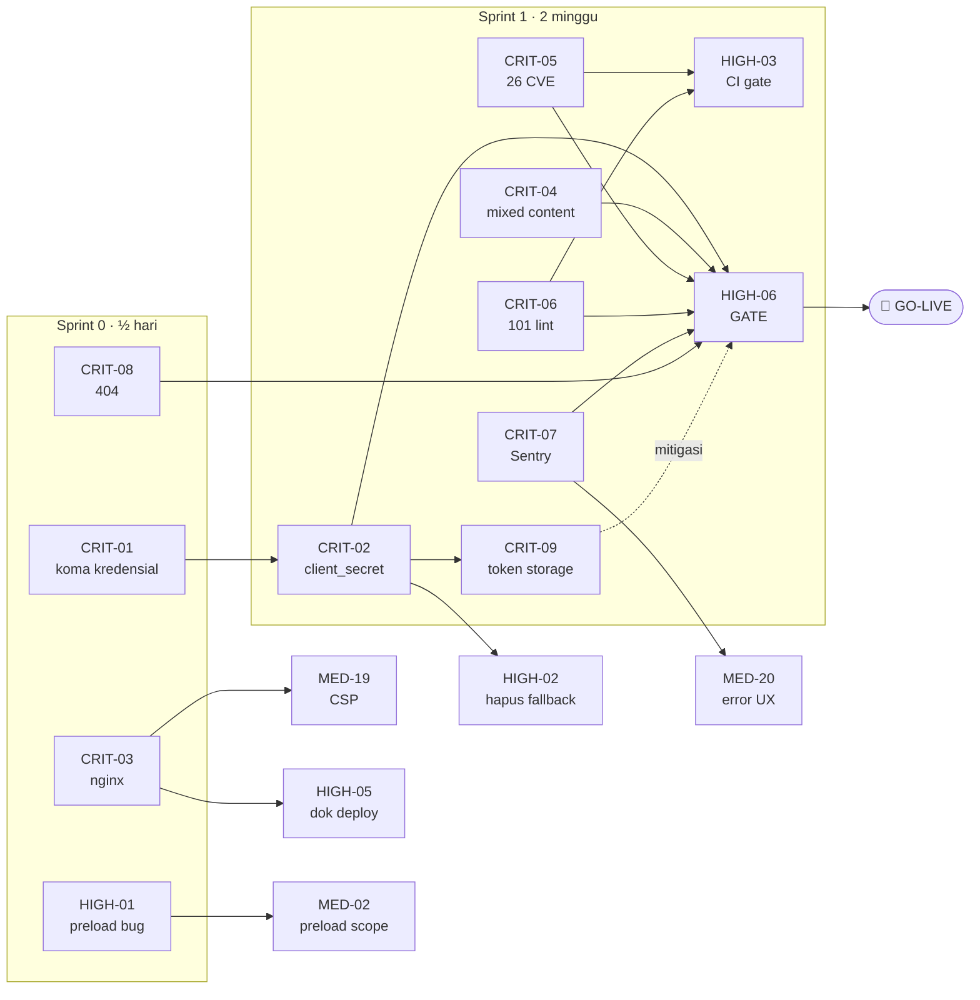

# Sprint Plan — Production Readiness
### Malakabooks Store (SS Online Shop)

| | |
|---|---|
| **Sumber** | [production-readiness-audit.md](production-readiness-audit.md) · [production-readiness-tasks.md](production-readiness-tasks.md) |
| **Tanggal** | 11 Agustus 2026 |
| **Branch** | `ssonlineshop` |
| **Cakupan** | 46 task, dikelompokkan ke 5 sprint + 7 workstream |
| **Estimasi ke go-live** | ~2–3 minggu (Sprint 0 + Sprint 1) |

---

## Prinsip Pengelompokan

Dokumen [production-readiness-tasks.md](production-readiness-tasks.md) mengurutkan task berdasarkan **severity**. Dokumen ini mengelompokkannya berdasarkan **keterkaitan kerja** — task yang menyentuh file yang sama, membutuhkan konteks mental yang sama, atau menunggu pihak yang sama.

Tiga aturan yang saya pakai:

**1. Task yang menyentuh file yang sama dikerjakan bersamaan.**
Membuka `angular.json` tiga kali di tiga sprint berbeda adalah pemborosan. `CRIT-03` (nginx), `MED-19` (CSP), dan `HIGH-05` (dokumentasi deploy) semuanya adalah "pekerjaan deployment" — satu orang, satu konteks, satu PR.

**2. Task Nice-to-Have TIDAK ditunda ke akhir — ia menumpang sprint yang menyentuh file yang sama.**
Ini perubahan terpenting dari daftar bertingkat. `NTH-02` (pindahkan `@types/*`) dan `NTH-03` (`engines`) sama-sama mengubah `package.json`, jadi ia ikut sprint dependency (`CRIT-05`), bukan menunggu berbulan-bulan di backlog. Effort tambahannya nyaris nol bila menumpang; jadi task tersendiri di kemudian hari, ia butuh review dan deploy sendiri.

**3. Task yang menunggu pihak lain dimulai paling awal.**
`CRIT-02`, `CRIT-04`, `CRIT-09`, dan `MED-12` semuanya butuh koordinasi backend/infra. *Lead time*-nya tidak bisa dikompres dengan menambah developer, jadi jam pertama Sprint 1 dipakai untuk mengirim permintaan — bukan untuk menulis kode.

---

## Peta Ketergantungan

---

## Ringkasan Sprint

| Sprint | Nama | Durasi | Task | Blocker go-live? |
|---|---|---|---|---|
| **0** | Hotfix Blocker | ½ hari | 6 | **Ya** |
| **1** | Go-Live Readiness | 2 minggu | 19 | **Ya** |
| **🚦** | **Gate — HIGH-06** | 1 hari | 1 | **Ya** |
| **2** | Stabilisasi Pasca-Rilis | 2 minggu | 8 | Tidak |
| **3** | SEO, Performa & Kualitas | 2–3 minggu | 11 | Tidak |
| **4** | Epic — SSR & PWA | 3–4 minggu | 2 | Tidak |

---
---

# 🔥 SPRINT 0 — Hotfix Blocker
### *Durasi: ½ hari · 6 task · Semua effort `S`*

**Tujuan:** menutup empat kegagalan yang akan terlihat pelanggan **di jam pertama** setelah rilis, dengan effort total di bawah satu hari kerja.

### Kenapa dikelompokkan begini

Enam task ini tidak punya kesamaan tematik — yang menyatukan mereka adalah **rasio dampak terhadap effort yang ekstrem**. Semuanya `S` atau lebih kecil, tidak satu pun butuh koordinasi pihak lain, dan tidak ada yang saling bergantung. Bisa dikerjakan satu orang dalam satu sesi, atau dibagi ke dua orang tanpa konflik merge.

Sengaja dipisah dari Sprint 1 supaya **tidak tersandera** oleh task yang menunggu backend. Kalau Sprint 1 molor dua minggu karena backend, empat kegagalan fatal ini sudah tertutup sejak hari pertama.

### Task

| ID | Task | Effort | File utama |
|---|---|---|---|
| `CRIT-01` | Hapus koma nyasar di `clientId`/`clientSecret` | 30 detik | `src/environments/environment.prod.ts` |
| `CRIT-03` | Commit `nginx.conf` — SPA fallback + brotli/gzip + cache header + HSTS/nosniff/referrer | S | *(file baru)* |
| `CRIT-08` | `NotFoundComponent` + route `/404` + perbaiki `admin-host.guard` | S | `app.routes.ts`, `admin-host.guard.ts` |
| `HIGH-01` | Perbaiki `timer(1000).pipe(() => load())` → `switchMap` | 5 menit | `selective-preloading-strategy.ts` |
| `HIGH-05` | Dokumentasikan proses deployment | S | `README.md` / `DEPLOYMENT.md` |
| `MED-01` | `<html lang="en">` → `lang="id"` | 30 detik | `src/index.html` |

### Catatan pengerjaan

- **`CRIT-01` dulu, sebelum apa pun.** Tiga puluh detik yang menentukan apakah ada user yang bisa login sama sekali. Fakta bahwa bug ini ada juga memberi tahu sesuatu: **build production belum pernah diuji melawan endpoint production.** Perbaiki, lalu segera lakukan smoke test login memakai build production sungguhan.
- **`CRIT-03` + `HIGH-05` satu paket** — sama-sama pekerjaan deployment, satu PR. Template `nginx.conf` lengkap ada di Kategori 7 laporan audit.
- **CSP sengaja TIDAK di sini.** Meski file-nya sama dengan `CRIT-03`, CSP butuh pengujian login Google (`accounts.google.com`) dan checkout DOKU (`jokul.doku.com`) yang bisa memakan waktu. Header murah tanpa risiko (HSTS, `X-Content-Type-Options`, `Referrer-Policy`) tetap masuk sekarang; CSP penuh menyusul di Sprint 1 Track D.
- **`HIGH-01`** — perhatikan bahwa `selective-preloading-strategy.ts` sudah dalam keadaan *modified* di working tree. Periksa perubahan yang belum ter-commit sebelum menimpanya.

### Definition of Done

- [ ] Login berhasil dengan build production melawan endpoint production
- [ ] Refresh langsung di `/product/123` memuat halaman, bukan 404 web server
- [ ] Response header menunjukkan `content-encoding: br`
- [ ] `/halaman-ngawur` menampilkan halaman 404 dengan URL tetap
- [ ] `/admin` dari domain publik menampilkan 404, bukan homepage
- [ ] Network tab: preload chunk mulai ~1 detik setelah initial load

---
---

# 🚨 SPRINT 1 — Go-Live Readiness
### *Durasi: 2 minggu · 19 task · 4 track paralel*

**Tujuan:** menutup seluruh sisa blocker go-live. Empat track dirancang agar bisa berjalan **bersamaan tanpa konflik file**.

### Kenapa dibagi 4 track

Setiap track punya area file, konteks mental, dan ketergantungan eksternal yang berbeda:

| Track | Fokus | Area file | Butuh pihak luar? |
|---|---|---|---|
| **A** | Auth & Kredensial | `environments/`, `core/services/auth-*`, `core/interceptors/` | **Ya** — backend |
| **B** | Dependency & Quality Gate | `package.json`, `angular.json`, `.github/`, lint fixes lintas file | Tidak |
| **C** | Observability & Error UX | `core/errors/`, `core/interceptors/error.*` | Ya — akun Sentry |
| **D** | Token Storage & CSP | `core/auth/`, `nginx.conf` | **Ya** — backend |

Track B **tidak bergantung pada siapa pun** — jadikan pekerjaan default saat track lain sedang menunggu balasan backend.

> ⚠️ **Konflik yang perlu diwaspadai:** Track A dan Track D sama-sama menyentuh `auth.interceptor.ts` dan `session.util.ts`. Kalau dikerjakan dua orang berbeda, selesaikan `CRIT-02` (Track A) lebih dulu, baru `CRIT-09` (Track D) menumpuk di atasnya. Jangan paralel penuh di dua file itu.

---

## Track A — Auth & Kredensial
*Owner: 1 FE dev + backend · Blocker terbesar*

| ID | Task | Effort | Menunggu |
|---|---|---|---|
| `CRIT-02` | Rotasi kredensial + keluarkan `client_secret` dari browser | S–L | Backend |
| `CRIT-04` | Perbaiki mixed content `posApiUrl` (HTTP → HTTPS) | S–M | Backend/infra |
| `HIGH-02` | Hapus fallback kredensial hardcoded (`\|\| 'MalakaBooks-FE'`) | S | `CRIT-02` |
| `MED-12` | Konfirmasi konsistensi host/port API production | S | Backend |
| `NTH-08` | Pindahkan Google Client ID ke `environment` | S | — |

**Kenapa dikelompokkan:** kelimanya menyentuh `environment.*.ts` dan/atau `auth-api.service.ts`, dan empat di antaranya menunggu jawaban backend yang sama.

**Aksi jam pertama — kirim semua permintaan backend sekaligus, jangan satu per satu:**
1. Rotasi kredensial `996cc633-...` (sudah masuk git history — anggap kompromi)
2. Daftarkan public client + PKCE, **atau** sediakan endpoint BFF
3. Sediakan endpoint POS ber-HTTPS untuk menggantikan `http://192.168.1.15:10100/`
4. Konfirmasi apakah port `17800` final — port non-standar sering diblokir jaringan korporat/sekolah/hotspot

> **Jalur cepat bila timeline mepet:** rotasi kredensial + public client PKCE (Pilihan B di `CRIT-02`) sudah cukup membuka go-live. Migrasi ke BFF dijadwalkan sebagai follow-up pasca-rilis.

---

## Track B — Dependency & Quality Gate
*Owner: 1 FE dev · Tidak bergantung siapa pun*

| ID | Task | Effort | Catatan |
|---|---|---|---|
| `CRIT-05` | `npm audit fix` + bump Angular ke `21.2.19+` | M | 26 CVE (1 critical, 19 high) |
| `CRIT-06` | 101 lint error → 0 | M | Batch cepat 28 error dulu |
| `HIGH-03` | CI: trigger branch, `npm audit` gate, upload artifact | S | Setelah dua di atas hijau |
| `NTH-01` | Housekeeping — hapus `lint_results.txt`, `AUDIT_PROMPTS.md`, `customs.css` | S | Menumpang `CRIT-06` |
| `NTH-02` | `@types/*` → `devDependencies` | S | Menumpang `CRIT-05` |
| `NTH-03` | `engines` + `.nvmrc` | S | Menumpang `CRIT-05` |
| `NTH-04` | Hapus `security.allowedHosts` kosong | S | Menumpang `angular.json` |
| `NTH-05` | Tambah `qrcode` ke `allowedCommonJsDependencies` | S | Menumpang `angular.json` |

**Kenapa dikelompokkan:** `CRIT-05`, `NTH-02`, dan `NTH-03` semuanya mengubah `package.json`. `NTH-04` dan `NTH-05` sama-sama `angular.json`. `NTH-01` dan `CRIT-06` sama-sama "membersihkan hasil lint". Menggabungkan berarti satu kali `npm install`, satu kali regression test, satu PR.

**Urutan wajib:** `CRIT-05` → `CRIT-06` → `HIGH-03`. Menaikkan versi Angular bisa memunculkan lint error baru, jadi jangan hijaukan lint sebelum dependency final.

**Catatan `CRIT-06`:** timebox 46 error `no-explicit-any`. Kalau tidak selesai, dorong ke `MED-16` di Sprint 3 — 55 error sisanya bersifat mekanis dan cukup untuk menghijaukan CI. Yang penting **CI hijau**, karena selama merah semua gate lain kehilangan makna.

**Catatan `NTH-01`:** `lint_results.txt` berisi 135 error tertanggal 10 Agustus, sementara angka aktual 101. Hapus **sebelum** mulai `CRIT-06`, supaya tidak ada yang mengerjakan berdasarkan daftar yang salah.

---

## Track C — Observability & Error UX
*Owner: 1 FE dev · Butuh akun Sentry*

| ID | Task | Effort | Catatan |
|---|---|---|---|
| `CRIT-07` | Pasang Sentry + release tracking + PII scrubbing | M | Butuh akun/DSN |
| `MED-20` | Notifikasi user di `GlobalErrorHandler` | S | Satu file dengan `CRIT-07` |
| `HIGH-04` | Petakan status 409 & 422 di `error.interceptor` | S | Satu file dengan `CRIT-07` |
| `NTH-06` | Eksplisitkan `sourceMap` → `hidden: true` untuk Sentry | S | Menumpang `CRIT-07` |

**Kenapa dikelompokkan:** keempatnya menyentuh jalur penanganan error yang sama — `global-error-handler.ts` dan `error.interceptor.ts`. `NTH-06` yang tadinya sekadar kerapian jadi **bermakna** di sini: hidden source map adalah yang membuat stack trace di Sentry terbaca.

**Aksi jam pertama:** siapkan akun/project Sentry. Ini pekerjaan admin, bukan koding, dan bisa memblokir sisa track.

**Jangan lupa PII scrubbing.** Aplikasi ini menyimpan token di `localStorage` dan memproses data pembayaran. Sentry yang dipasang tanpa scrubbing hanya memindahkan kebocoran data ke pihak ketiga.

---

## Track D — Token Storage & CSP
*Owner: 1 FE dev + backend · Track terpanjang*

| ID | Task | Effort | Catatan |
|---|---|---|---|
| `CRIT-09` | Refresh token keluar dari `localStorage` → cookie `HttpOnly` | L | Butuh backend |
| `MED-19` | CSP penuh + verifikasi Google GSI & DOKU | S | Lanjutan `CRIT-03` |

**Kenapa dikelompokkan:** keduanya menjawab ancaman yang sama — **XSS mencuri sesi**. `CRIT-09` menghilangkan sasarannya; `MED-19` mempersempit jalan masuknya. Dikerjakan bersama karena kalau `CRIT-09` tidak selesai tepat waktu, `MED-19` menjadi mitigasi penggantinya.

**Ini track paling berisiko molor.** Mulai hari pertama bersamaan Track A, karena permintaan backend-nya bisa digabung dalam satu percakapan.

> **Rencana kontingensi bila `CRIT-09` tidak selesai sebelum go-live:**
> - [ ] Refresh token keluar dari `localStorage` (minimal ini)
> - [ ] Perpendek TTL access token
> - [ ] CSP ketat (`MED-19`) — wajib, bukan opsional
> - [ ] **Catat sebagai risiko yang diterima sadar** di dokumen rilis, dengan tanggal target penyelesaian
>
> Risiko yang dicatat dan dijadwalkan adalah keputusan engineering. Risiko yang diam-diam dilewati adalah utang yang tidak diakui.

---

## 🚦 GATE — `HIGH-06` Verifikasi Go-Live
*Durasi: 1 hari · Tidak boleh dilewati*

Setelah keempat track selesai, jalankan verifikasi menyeluruh sebelum rilis.

**Verifikasi otomatis:**
- [ ] `npm audit --audit-level=high` → exit code 0
- [ ] `npm run lint` → exit code 0
- [ ] `npm run test:ci` → hijau
- [ ] `ng build --configuration production` → sukses, nol warning
- [ ] CI hijau di branch `ssonlineshop`

**Verifikasi manual — wajib memakai build production melawan endpoint production:**
- [ ] Login customer berhasil
- [ ] Login admin berhasil
- [ ] Refresh halaman di route dalam (`/product/:id`, `/order-history`)
- [ ] Share link produk ke WhatsApp — tidak 404
- [ ] Checkout end-to-end sampai order success
- [ ] Order katalog B2C berhasil (verifikasi `CRIT-04`)
- [ ] Console browser bersih dari warning mixed content
- [ ] Error yang dilempar sengaja muncul di dashboard Sentry

**Kriteria rilis:** nol temuan ❌ Kritikal tersisa · skor audit ≥ 8/10 · perbarui [production-readiness-audit.md](production-readiness-audit.md).

---
---

# SPRINT 2 — Stabilisasi Pasca-Rilis
### *Durasi: 2 minggu · 8 task · Bukan blocker*

**Tujuan:** menutup celah yang muncul saat aplikasi menghadapi pengguna nyata — kegagalan senyap, state kosong tanpa jalan keluar, dan jalur uang yang belum tertutup test.

### Kenapa dikelompokkan begini

Semua task di sini adalah **"apa yang terjadi saat sesuatu gagal"** — dan itu baru terasa setelah ada trafik nyata. Dikerjakan setelah rilis karena masing-masing memerlukan pemahaman tentang kegagalan mana yang benar-benar sering terjadi, bukan yang kita duga.

### Task

| ID | Task | Effort | Kelompok |
|---|---|---|---|
| `MED-05` | Refresh-token lock di `auth.interceptor` | S | Ketahanan auth |
| `MED-04` | `takeUntilDestroyed` di katalog-cart + search-bar | S | Ketahanan auth |
| `MED-06` | Sanitasi AWB di `shipping-label.service` | S | Keamanan sisa |
| `MED-11` | Sanitasi HTML deskripsi produk di backend | M | Keamanan sisa |
| `MED-10` | Error state + retry per halaman | M | UX kegagalan |
| `MED-07` | Banner offline global | S | UX kegagalan |
| `MED-13` | Test guard, interceptor & pipe yang belum tercakup | M | Test |
| `MED-14` | Test service jalur uang + threshold coverage | M | Test |

### Catatan pengerjaan

- **`MED-05` + `MED-04` satu paket** — keduanya soal *lifecycle* subscription, dan `MED-05` menyentuh `auth.interceptor.ts` yang baru saja diubah di Sprint 1. Kerjakan selagi konteksnya masih segar.
- **`MED-10` + `MED-07` satu paket** — keduanya menambahkan UI state untuk kondisi gagal. Rancang komponen state bersama, jangan dua pola berbeda.
- **`MED-13` + `MED-14` satu paket.** Mulai dari `MED-13` (guard/interceptor/pipe — murah dan cepat) untuk membangun kebiasaan, baru masuk `MED-14` (service jalur uang). **Pasang `thresholds` di `vitest.config.ts` lebih dulu**, meski awalnya rendah — tanpa angka yang ditegakkan, coverage akan melorot lagi.
- **`MED-11` butuh backend** — kirim permintaannya di awal sprint.

### Definition of Done

- [ ] 5 request 401 paralel hanya memicu satu panggilan `/connect/token`
- [ ] `npm run test:ci` melaporkan coverage dan gagal bila di bawah threshold
- [ ] Blokir endpoint di DevTools → halaman menampilkan error + tombol retry yang berfungsi
- [ ] Mode airplane memunculkan banner offline

---
---

# SPRINT 3 — SEO, Performa & Kualitas
### *Durasi: 2–3 minggu · 11 task · Bukan blocker*

**Tujuan:** membuat aplikasi bisa ditemukan, dipakai semua orang, dan tidak melambat seiring waktu.

### Kenapa dikelompokkan begini

Tiga kelompok berbeda yang digabung dalam satu sprint karena sama-sama **bersifat menyapu** — masing-masing menyentuh banyak file dengan perubahan kecil yang seragam, dan semuanya cocok dikerjakan dengan alat ukur di tangan (Lighthouse, axe, bundle analyzer).

### Kelompok 3.1 — SEO *(dampak bisnis tertinggi di sprint ini)*

| ID | Task | Effort |
|---|---|---|
| `MED-17` | `Meta` + `Title` dinamis + Open Graph + JSON-LD Product | M |

> 💡 **Pertimbangkan menaikkan ini ke Sprint 1.** Bisa dikerjakan **tanpa** SSR, tidak bergantung pada siapa pun, dan langsung memperbaiki tab title, bookmark, serta preview share WhatsApp. Kalau trafik organik penting sejak hari pertama, ini task dengan rasio dampak-terhadap-effort terbaik di luar Sprint 0. Saya letakkan di sini hanya karena secara teknis bukan blocker.

### Kelompok 3.2 — Aksesibilitas & Kebersihan Template

| ID | Task | Effort |
|---|---|---|
| `MED-08` | 6 label tanpa asosiasi, 2 pelanggaran keyboard, audit kontras warna | S |
| `MED-03` | Migrasi `*ngFor` legacy terakhir → `@for` + `track` | S |
| `MED-16` | Bereskan 46 error `no-explicit-any` | M |

**Kenapa bersama:** `MED-08` dan `MED-03` menyelesaikan sisa pelanggaran lint template dari `CRIT-06`. Setelah keduanya, `ng lint` benar-benar bersih tanpa pengecualian.

### Kelompok 3.3 — Performa

| ID | Task | Effort |
|---|---|---|
| `MED-09` | Migrasi 38 `` ke `NgOptimizedImage` + dimensi eksplisit | M |
| `MED-02` | Rapikan cakupan `preload: true` (17 route → 4) | S |
| `NTH-09` | Subset font boxicons ke woff2 saja | S |
| `NTH-07` | Perketat budget `angular.json` | S |
| `NTH-10` | `OnPush` di 5 komponen sisa | S |

**Kenapa bersama:** semuanya diverifikasi dengan alat yang sama (Lighthouse + network tab + output build). Satu sesi pengukuran, satu baseline, satu perbandingan sesudah.

**Urutan:** `NTH-07` (budget) **terakhir** — kunci hasilnya setelah semua optimasi selesai, supaya angka baseline-nya realistis.

### Kelompok 3.4 — E2E

| ID | Task | Effort |
|---|---|---|
| `MED-15` | Playwright — 3 skenario (login, checkout, admin CRUD) | M |

**Kerjakan paling akhir di sprint ini.** E2E yang ditulis di atas UI yang masih berubah (`MED-09`, `MED-08` mengubah markup) akan langsung rusak. Tulis setelah template stabil.

### Definition of Done

- [ ] Setiap halaman produk punya title unik; preview WhatsApp menampilkan judul + gambar
- [ ] `ng lint` bersih tanpa pengecualian
- [ ] CLS < 0,1 di Lighthouse mobile untuk product-detail dan order-history
- [ ] Nol isu kontras "serious" di axe
- [ ] Network tab: ≤ 4 chunk terpreload, bukan 17
- [ ] `npx playwright test` hijau di CI

---
---

# SPRINT 4 — Epic: SSR & PWA
### *Durasi: 3–4 minggu · 2 task · Backlog*

**Tujuan:** perubahan arsitektural yang mengubah cara aplikasi dirender dan disajikan.

| ID | Task | Effort | Dependensi |
|---|---|---|---|
| `MED-18` | SSR / prerendering hybrid untuk halaman publik | L | `MED-17`, `CRIT-03` |
| `NTH-11` | Service Worker / PWA | M | `CRIT-03` |

### Kenapa dipisah jadi epic tersendiri

`MED-18` bukan sekadar task besar — ia **mengubah asumsi dasar** aplikasi:

- 55 pemakaian `localStorage` harus aman di server *(sebagian kode sudah defensif dengan `typeof localStorage === 'undefined'` ✅ — modal awal yang bagus)*
- Hosting berubah dari static host menjadi butuh Node runtime — konfigurasi di `CRIT-03` perlu ditinjau ulang
- Rendering hybrid per-route: **SSG** untuk `/`, `/product`, `/mardika-kopi` · **SSR** untuk `/product/:id` · **CSR** untuk admin & checkout

Terlalu berisiko diburu berbarengan dengan pekerjaan lain. Butuh sprint dengan jendela regression testing tersendiri.

`NTH-11` (PWA) digabung di sini karena sama-sama menyentuh lapisan penyajian dan sama-sama perlu peninjauan ulang strategi caching di `nginx.conf`.

> **Prasyarat:** kerjakan `MED-17` (Sprint 3) lebih dulu. SSR tanpa meta tag dinamis hanya menyajikan HTML kosong lebih cepat — mesin pencari tetap melihat halaman yang seragam.

---
---

# Workstream — Tampilan Tematik

Bila Anda lebih suka mengorganisir per orang/keahlian daripada per waktu, ini pengelompokan yang sama dilihat dari sudut tema:

| Workstream | Task | Sprint | Butuh pihak luar |
|---|---|---|---|
| **Auth & Kredensial** | `CRIT-01` `CRIT-02` `HIGH-02` `MED-05` `NTH-08` | 0, 1, 2 | Backend |
| **Deployment & Infra** | `CRIT-03` `CRIT-04` `MED-19` `HIGH-05` `MED-12` `NTH-11` | 0, 1, 4 | Backend/infra |
| **Dependency & Quality Gate** | `CRIT-05` `CRIT-06` `HIGH-03` `MED-16` `NTH-01`…`05` | 1, 3 | — |
| **Observability & Error UX** | `CRIT-07` `CRIT-08` `MED-20` `HIGH-04` `MED-10` `MED-07` `NTH-06` | 0, 1, 2 | Akun Sentry |
| **Keamanan Data** | `CRIT-09` `MED-06` `MED-11` `MED-19` | 1, 2 | Backend |
| **Performa & Rendering** | `HIGH-01` `MED-02` `MED-03` `MED-09` `MED-18` `NTH-07` `NTH-09` `NTH-10` | 0, 3, 4 | — |
| **SEO & Aksesibilitas** | `MED-01` `MED-08` `MED-17` `MED-18` | 0, 3, 4 | — |
| **Testing** | `MED-13` `MED-14` `MED-15` | 2, 3 | — |

---

# Alokasi Tim

Rencana di atas mengasumsikan **2 FE dev + akses ke backend**. Penyesuaian bila komposisinya berbeda:

### 1 FE dev
Sprint 1 menjadi ~3–4 minggu. Urutan serial yang disarankan:
**Track B** (tidak menunggu siapa pun) → **Track A** → **Track C** → **Track D**.
Kirim semua permintaan backend di hari pertama, lalu kerjakan Track B selama menunggu.

### 3+ FE dev
Keempat track Sprint 1 benar-benar paralel, kecuali satu batasan: **Track A dan Track D tidak boleh menyentuh `auth.interceptor.ts` dan `session.util.ts` bersamaan.** Selesaikan `CRIT-02` lebih dulu, baru `CRIT-09` menumpuk di atasnya.
Sisa kapasitas: tarik `MED-17` (SEO) naik dari Sprint 3 — nilainya tinggi dan tidak bergantung pada apa pun.

### Backend lambat merespons
Track B dan Track C berjalan penuh tanpa backend. Bila `CRIT-02` dan `CRIT-04` tersendat lebih dari satu minggu, **eskalasikan** — keduanya blocker mutlak yang tidak bisa di-*workaround* dari sisi frontend.

---

# Ringkasan Alokasi Task

| Sprint | Kritikal | Tinggi | Sedang | Nice-to-Have | Total |
|---|---|---|---|---|---|
| **0** — Hotfix | 3 | 2 | 1 | 0 | **6** |
| **1** — Go-Live | 6 | 4 | 2 | 7 | **19** |
| **2** — Stabilisasi | 0 | 0 | 8 | 0 | **8** |
| **3** — SEO/Performa | 0 | 0 | 7 | 4 | **11** |
| **4** — Epic | 0 | 0 | 1 | 1 | **2** |
| **Total** | **9** | **6** | **19** | **12** | **46** |

> Perhatikan baris Sprint 1: **7 task Nice-to-Have** dikerjakan di sprint blocker. Itu disengaja. Semuanya menumpang file yang memang sedang dibuka (`package.json`, `angular.json`, error handler) sehingga effort tambahannya nyaris nol — sementara menundanya ke backlog berarti masing-masing kelak butuh PR, review, dan deploy sendiri.

---

## Tiga Hal yang Menentukan Keberhasilan Rencana Ini

1. **Sprint 0 dikerjakan hari ini, bukan "nanti bersama Sprint 1".** Empat kegagalan fatal tertutup dalam setengah hari. Menundanya sampai Sprint 1 selesai berarti menyandera perbaikan setengah hari pada pekerjaan dua minggu yang bergantung pada pihak lain.

2. **Permintaan backend dikirim di jam pertama Sprint 1, semuanya sekaligus.** `CRIT-02`, `CRIT-04`, `CRIT-09`, dan `MED-12` menunggu pihak yang sama. *Lead time* tidak bisa dikompres dengan menambah developer — hanya bisa dikompres dengan meminta lebih awal.

3. **`CRIT-06` (CI hijau) adalah prasyarat, bukan kerapian.** Selama pipeline merah, hasil `npm audit`, test, dan build tidak ada yang memperhatikan. Menghijaukan CI adalah yang membuat semua perbaikan lain **tetap bertahan** setelah sprint ini berakhir.

---

*Dokumen ini hanya berisi rencana. Tidak ada file sumber yang diubah saat pembuatannya.*
